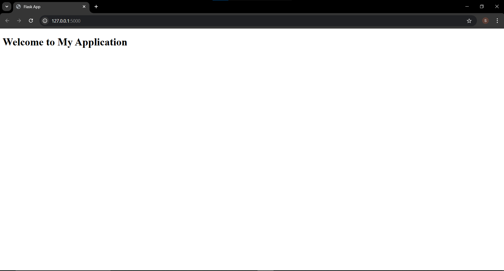
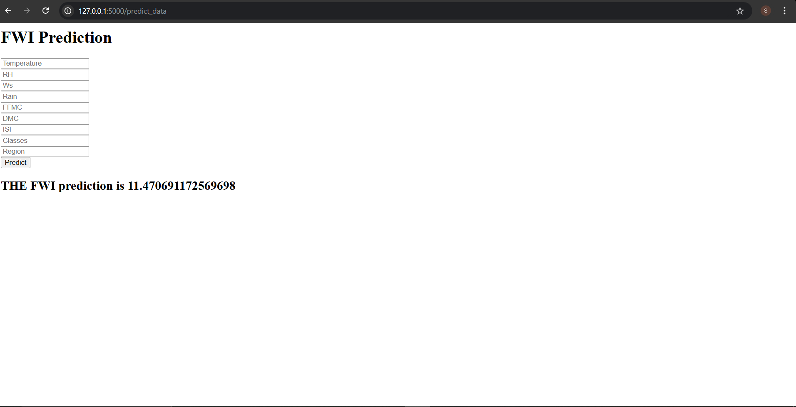

# Algerian Forest Fires Prediction

## Project Overview
This project aims to predict the occurrence and severity of forest fires in Algeria based on various environmental attributes. The dataset used is the **Algerian Forest Fires Dataset**, which contains meteorological and fire-related data collected from two regions: **Bejaia (northeast Algeria) and Sidi Bel-abbes (northwest Algeria)**.

## Dataset Information
The dataset consists of **244 instances**, with **122 instances for each region**. Data was recorded between **June 2012 and September 2012**. The dataset includes **11 attributes and 1 output attribute (class)**. The instances are classified into **Fire (138 instances)** and **Not Fire (106 instances)** categories.

### Attribute Information
1. **Date**: (DD/MM/YYYY) - Day, Month ('June' to 'September'), Year (2012).
2. **Temp**: Maximum temperature at noon in Celsius (22 to 42°C).
3. **RH**: Relative Humidity (%) (21 to 90).
4. **Ws**: Wind speed in km/h (6 to 29).
5. **Rain**: Total rainfall for the day in mm (0 to 16.8).
6. **FFMC**: Fine Fuel Moisture Code index (28.6 to 92.5).
7. **DMC**: Duff Moisture Code index (1.1 to 65.9).
8. **DC**: Drought Code index (7 to 220.4).
9. **ISI**: Initial Spread Index (0 to 18.5).
10. **BUI**: Buildup Index (1.1 to 68).
11. **FWI**: Fire Weather Index (0 to 31.1).
12. **Class**: Binary classification - **Fire** or **Not Fire**.

## Workflow
The project follows a structured machine learning pipeline:

1. **Data Cleaning & Preprocessing**
   - Handled missing values and inconsistent data entries.
   - Standardized and formatted the dataset for better analysis.
   
2. **Exploratory Data Analysis (EDA)**
   - Visualized data distributions and relationships between features.
   - Identified important features influencing fire occurrences.

3. **Model Training & Evaluation**
   - Tested multiple regression models: **Linear Regression, Lasso Regression, Ridge Regression, and ElasticNet**.
   - Selected **Ridge Regression** as the final model based on the lowest cost function.

4. **Model Serialization**
   - Saved the trained Ridge Regression model using the `pickle` library for future use.

5. **Web Application Deployment**
   - Developed an interactive web application using **Flask**.
   - Integrated the trained model into the web app for real-time fire prediction based on user inputs.
   - **Deployed the web application on AWS** for public accessibility.

## Features
- **Predicts forest fire occurrence** based on environmental attributes.
- **Uses Ridge Regression** for optimal performance.
- **Interactive web application** built with Flask.
- **Deployed on AWS**, making it accessible from anywhere.
- **User-friendly interface** to input weather conditions and receive predictions.
- **Fast and accurate predictions** based on trained machine learning models.
## Screenshots

### Home Page

### Prediction Result

